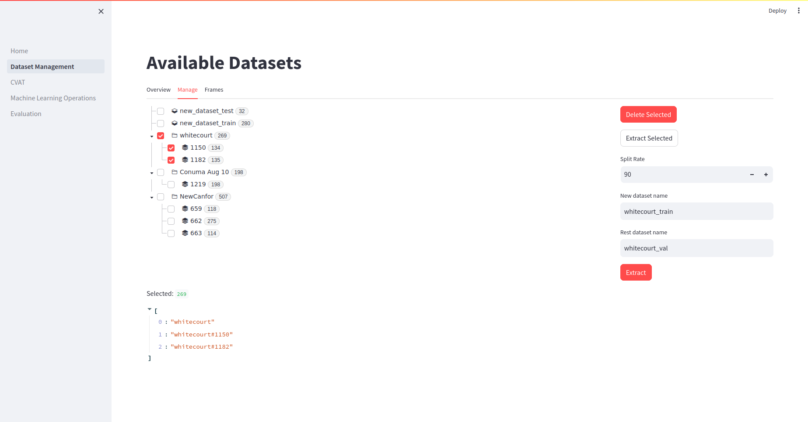
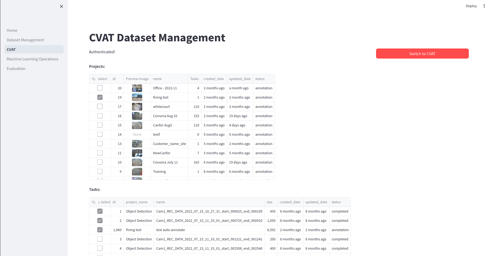
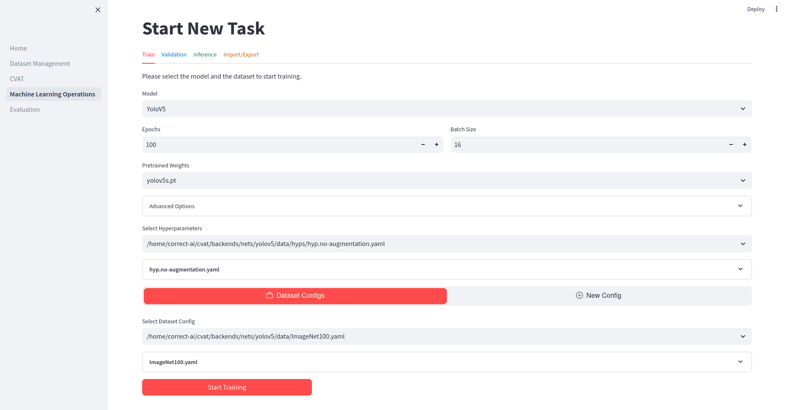
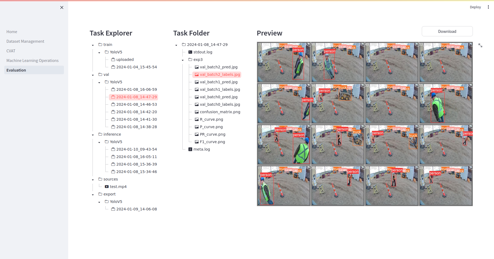

# Correct-AI MLOps Tools

## Overview

The Correct-AI MLOps Tools is a collection of tools designed to streamline the process of machine learning projects. 
These tools provide functionalities for the entire machine learning life-cycle, includes:

- Download and process annotated datasets from CVAT
  - Smart data selection and download
  - Remap class IDs
  - Convert to the Yolo dataset format
  - Preview, Sample and meta logging  
  - Create and modify train and validation sets
  - Link to external datasets
- Schedule and executing MLOps Tasks
  - Train, validation, inference, export, and import models
  - All tasks are executed in a queue with cancelation
  - Easy interface to create different tasks with full customization
  - Advanced task logging and tracking
  - Browser for evaluate results

## Getting Started

To use the Correct-AI MLOps Tools, follow these steps:

1. Install the required dependencies for the main program:  
   ```pip install -r requirement.txt```
2. Setup `config.json` for connection.
3. Create virtual environments for each machine learning model under `backends/nets`.
4. Run the command: `streamlit run src/Home.py`.
5. You may deploy CVAT, training server, web server at different location.

---

## User Manual


### **1. Dataset Management Page**

- Overview of datasets
- Tree view of datasets
- Select and delete datasets
- Extract subsets of datasets
- Display images with bounding box annotations

#### Dataset Overview (Overview Tab)

The first tab shows the **overview** of all the datasets on this server. You can see the **amount of images** and **task meta data** in each dataset project.

#### Tree View (Manage Tab)

The **tree view** on the left side of the page displays the datasets in a hierarchical structure. You can expand and collapse the tree nodes to navigate through the datasets.

#### Select and Delete Datasets

To delete a dataset, select it from the tree view by checking the **checkbox** next to its name. Then, click the "**Delete Selected**" button. This will remove the selected datasets from the system.

#### Extract Subsets of Datasets

You can **extract subsets** of datasets by **selecting images** and **specifying the split rate**. To select images, check the **checkboxes** next to their names in the **tree view**. Then, click the "**Extract Selected**" button. You will be prompted to enter the **split rate** and provide a **name** for the new dataset. If the **split rate** is set to **100%**, the **entire** selected dataset will be extracted as a new dataset. Otherwise, **a random subset** of images will be extracted based on the **specified split rate** and create **the rest subset**.

#### Display Images with Bounding Box Annotations (Frames Tab)

If there are selected images, they will be **displayed** in the main area of the page. You can use the **slider** to navigate through the images. Each image is shown with its corresponding bounding box **annotations**. The annotations are loaded from the label files associated with the images.

If no images are selected, a message will be displayed indicating that no images are selected.



### **2. CVAT Page**

This page is responsible for managing projects and tasks in the CVAT application. It provides a user-friendly interface for selecting and downloading tasks.

#### Projects

The **Projects** section displays a table of projects with the following columns:

- **Select**: Checkbox column to select projects for download.
- **ID**: Project ID.
- **Preview**: Preview image of the project.
- **Name**: Name of the project.
- **Tasks**: Number of tasks in the project.
- **Created Date**: Date when the project was created.
- **Updated Date**: Date when the project was last updated.
- **Status**: Status of the project.

You can select one or more projects by checking the corresponding checkboxes. When a project is selected, all tasks within that project will be automatically selected.

#### Tasks

The **Tasks** section displays a table of tasks with the following columns:

- **Select**: Checkbox column to select tasks for download.
- **ID**: Task ID.
- **Project Name**: Name of the project to which the task belongs.
- **Name**: Name of the task.
- **Size**: Size of the task.
- **Created Date**: Date when the task was created.
- **Updated Date**: Date when the task was last updated.
- **Status**: Status of the task.

You can select one or more tasks by checking the corresponding checkboxes.

#### Download Selected Tasks

Clicking the **Download Selected Tasks** button will initiate the download process for the selected tasks. The progress of the download will be displayed in a progress bar. The tasks will be downloaded as ZIP files and saved in the specified dataset path.

During the download process, the following steps will be performed for each selected task:

1. Check if the task is already up to date by comparing the updated date with the existing metafiles.
2. If the task is up to date, skip the download and move to the next task.
3. If the task has not been downloaded before, download it using the CVAT API and save it as a ZIP file.
4. Unzip the downloaded task to the dataset path.
5. Remap the annotations of the task using the provided remap dictionary.
6. Prepare the dataset for further processing.
7. Update the progress bar with the downloaded size.

Once all selected tasks have been downloaded and processed, the progress bar will reach 100% and display "Done!".

Please note that this page requires access to the CVAT API and the specified dataset path for downloading and processing tasks.  



### **3. MLops Management Page**

The MLops Management Page allows users to create new sessions for object detection models. Users can select the model, dataset, hyperparameters, and other options to customize their tasks.

#### Train Workflow

1. **Select Model**: Choose the object detection model from the available options (YoloV5 or YoloV8) using the dropdown menu.

2. **Set Training Parameters**: Specify the number of epochs and batch size for the training process using the number input fields.  
Select a pretrain model or start from scratch.

3. **Advanced Options**: Expand this section to access additional options for the training process. Enter any extra arguments (like `--save-period` ) or remarks related to the training.

4. **Select Hyperparameters**: Choose the hyperparameter file for the selected model from the available options using the dropdown menu. The content of the selected hyperparameter file will be displayed in a code block.

5. **Select Dataset Configuration**: Choose the dataset configuration for training. If the "Dataset Configs" option is selected, a dropdown menu will appear with available dataset configurations. Selecting a configuration will display its content in a code block. If the "New Config" option is selected, enter a name for the new configuration and select the training and validation datasets from the available options.

6. **Start Training**: Click the "Start Training" button to initiate the training process. The selected model, training parameters, hyperparameters, dataset configuration, extra arguments, and remarks will be used for training. The training process will be sent to the server for execution.

7. **Save Config**: If a new dataset configuration is created, the "Save Config" button will be enabled. Click this button to save the configuration. The configuration will be saved with the specified name and the selected training and validation datasets.

#### Validation Workflow

1. **Select Model**: Choose the trained model you want to validate from the dropdown menu.

2. **Select Dataset**: Choose the dataset you want to use for validation from the dropdown menu. This dataset should be different from the one used for training to ensure an unbiased evaluation of the model.

3. **Set Validation Parameters**: Specify any necessary parameters for the validation process. This could include things like the confidence threshold for object detection.

4. **Start Validation**: Click the "Start Validation" button to begin the validation process. The selected model and dataset, along with the specified parameters, will be used for validation. The validation process will be sent to the server for execution.  

#### Inference Workflow

1. **Select Model**: Choose the trained model you want to use for inference from the dropdown menu.

2. **Load Data**: Load the data you want to run inference on.
   You can also upload videos or images.

3. **Set Inference Parameters**: Specify any necessary parameters for the inference process. This could include things like the confidence threshold for object detection.

4. **Start Inference**: Click the "Start Inference" button to begin the inference process. The selected model and data, along with the specified parameters, will be used for inference. The inference process will be sent to the server for execution.

#### Export and Import

1. **Export A Model**: Choose the model and click the "Start Export" button to sent the process to the server for execution.  
2. **Import A modal**: You can also upload model checkpoints and they can be used in the operations.  



#### Cancelation of Tasks

The scheduler executes tasks in a queue, you can stop the current job  
or remove the tasks in the queue by selecting the items and pressing the button.  

### **4. Evaluation Page**

In this page, you can browse the results of all kinds of task runs.
You can download and visualize the data by selecting the files.
